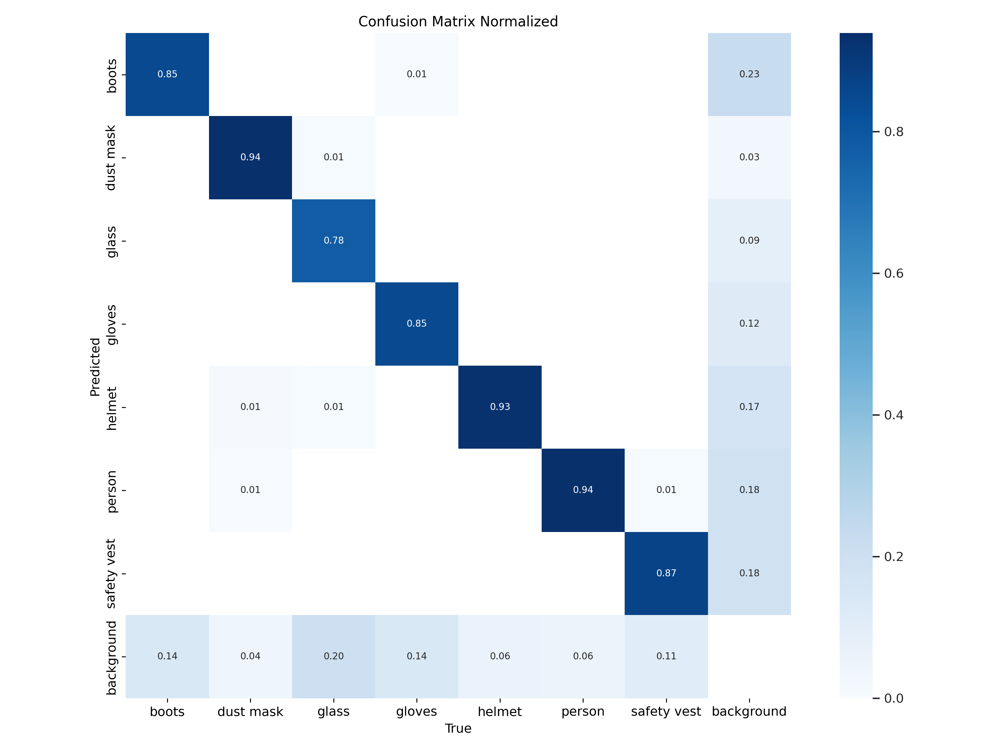

---

## Construction Worker PPE Inspection & Tracking System

This project is a comprehensive real-time **computer vision system** designed to ensure safety compliance and workforce monitoring at construction sites. It uses deep learning and video processing to:

* Inspect Personal Protective Equipment (PPE) before entry
* Detect workers with or without PPE inside the construction area
* Track the total number of workers over time with automatic logging

> 🎓 This system was developed as the **final project** for the course **Machine Vision**, under the guidance of **Ph.D. Nguyen Van Thai** at **Ho Chi Minh City University of Technology and Education**.

---

## System Modes

### 1. **Inspection Mode**

* Verifies if each worker entering the site is wearing **full PPE**.
* Displays status with ✅/❌ for helmet, vest, boots, gloves, and dust mask.

---

### 2. **Detection Mode**

* Scans the construction area to **identify workers** with or without PPE.
* Raises an alert for non-compliant individuals (missing helmet or vest).

---

### 3. **Tracking Mode**

* Counts the number of workers **over time** using a fixed camera.
* Saves time-stamped statistics to `Tracking_State.csv`.

## Sample Output from Tracking Mode

| Date Time                | Number of Workers | State   |
|--------------------------|-------------------|---------|
| June 26, 2024 21:48:59   | 5                 | Normal  |
| June 26, 2024 21:49:00   | 5                 | Normal  |
| June 26, 2024 21:49:01   | 5                 | Normal  |
| June 26, 2024 21:49:02   | 4                 | Missing |
| June 26, 2024 21:49:03   | 5                 | Normal  |
| June 26, 2024 21:49:04   | 4                 | Missing |
| June 26, 2024 21:49:05   | 4                 | Missing |

---

## Features

* **PyQt5 GUI** for interactive use
* **YOLOv8 model** for object detection
* Real-time processing of images & videos
* Auto-logging of workforce statistics in CSV
* PPE categories: Helmet, Vest, Boots, Gloves, Dust Mask



---

## How to Run the Project

### 🔧 Requirements

Install dependencies:

```bash
pip install -r requirements.txt
```

Or manually:

```bash
pip install PyQt5 opencv-python ultralytics pillow pandas
```

---

### Pre-trained Model

Ensure you have the YOLOv8 trained model file:

```
runs/detect/yolov8m.pt_train_120_epochs/weights/best.pt
```

If not, update this path in `UI.py`:

```python
self.model = YOLO('path_of_your_weight_model.pt') 

"Note: If you want to get our pretrained model, please contact me through the email: 
ph3574446@gmail.com"
```

---

### Start the App

```bash
python UI.py
```

Or if using the full-screen intro interface:

```bash
python background.py
```

---

## Project Structure

```
📁 PPE-Construction-Inspection/
├── UI.py                 # Main GUI with all 3 modes
├── Detection.py          # Detection logic with YOLO
├── background.py         # Optional front page UI
├── Tracking_State.csv    # Output CSV for worker count
├── *.png                 # Screenshots for illustration
└── requirements.txt      # Python dependencies
```

---

## Notes

* All detections use the **YOLOv8 model** from Ultralytics.
* Detection classes must match this list:

  ```
  ['boots', 'dust mask', 'glass', 'gloves', 'helmet', 'person', 'safety vest']
  ```
* The system is fully offline and local—no cloud/internet required.

---

## Demo Video

Watch the full system demo here:

[](https://www.youtube.com/watch?v=BOTAOOJb7Rg)


## Contributors

Final Term Project – Ho Chi Minh City University of Technology and Education
**Instructor**: Ph.D. Nguyen Van Thai

**Performers**:

* Dinh Duc Duy – 22134001
* Le Quoc Thinh – 21134013
* Huynh Thanh Phong – 21134009

---
